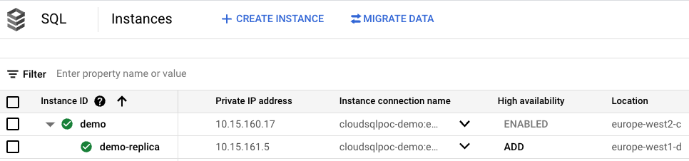

# Cloud SQL Multi Region Failover and Failback

* 
The Following Scripts are to be used for Cloud SQL Failover
This assumes that there already is a CloudSQL instance in Region1 with a Read Replica in Region2.
For Cost Savings ensure that the Read Replica in Region2 is not HA

### Before you begin
Kindly edit the following Values in your Makefile
PROJECT=<UPDATEME>
PRIMARY_REGION=<UPDATEME> example: europe-west2
FAILOVER_REGION=<UPDATEME> example: europe-west2
PRIMARY_INSTANCE=<UPDATEME> Name of the Cloud Instance
READ_REPLICA=<UPDATEME> Name of the Read Replica
MAINTENANCE_WINDOW_DAY=<UPDATEME> example: SUN
MAINTENANCE_WINDOW_HOUR=<UPDATEME> example: 03
BACKUP_START_TIME=<UPDATEME> example: 02:00


### Make commands
The entire process is driven by a make file
type `make` in the root folder to get a help menu as below

```bash
help                           This is help
init                           Update gcloud
failover                       Failover to Read Replica - use in event of Regional Failover
failover_replica               Create a Read Replica to the newly promoted Primary
failback                       Failback to the Original Primary
status                         Output the Current State of the Deployment
```

### make status
The `make status` command shows an output as shown below - Use this command to know the current state of the Deployment
```bash
┌────────────────────────────────────────────────────────────────────────────────────────────────────────────────────────────────────────────────────────────────────┐
│                                                                    ✨ Primary Instance:demo ✨                                                                     │
├──────┬──────────────┬────────────────┬───────────────────┬──────────────────┬────────────────────────────────────┬──────────┬──────────────────┬───────────────────┤
│ NAME │    REGION    │    GCE_ZONE    │ AVAILABILITY_TYPE │ DATABASE_VERSION │          CONNECTION_NAME           │  STATE   │  REPLICA_NAMES   │        TIER       │
├──────┼──────────────┼────────────────┼───────────────────┼──────────────────┼────────────────────────────────────┼──────────┼──────────────────┼───────────────────┤
│ demo │ europe-west2 │ europe-west2-c │ REGIONAL          │ POSTGRES_14      │ cloudsqlpoc-xxxx:europe-west2:demo │ RUNNABLE │ ['demo-replica'] │ db-custom-4-26624 │
└──────┴──────────────┴────────────────┴───────────────────┴──────────────────┴────────────────────────────────────┴──────────┴──────────────────┴───────────────────┘
┌─────────────────────────────────────────────────────────────────────────────────────────────────────────────────────────────────────────────────────────────────┐
│                                                                 ✨ Read Replica:demo-replica ✨                                                                 │
├──────────────┬──────────────┬────────────────┬───────────────────┬──────────────────┬────────────────────────────────────────────┬──────────┬───────────────────┤
│     NAME     │    REGION    │    GCE_ZONE    │ AVAILABILITY_TYPE │ DATABASE_VERSION │              CONNECTION_NAME               │  STATE   │        TIER       │
├──────────────┼──────────────┼────────────────┼───────────────────┼──────────────────┼────────────────────────────────────────────┼──────────┼───────────────────┤
│ demo-replica │ europe-west1 │ europe-west1-d │ ZONAL             │ POSTGRES_14      │ cloudsqlpoc-xxxx:europe-west1:demo-replica │ RUNNABLE │ db-custom-4-26624 │
└──────────────┴──────────────┴────────────────┴───────────────────┴──────────────────┴────────────────────────────────────────────┴──────────┴───────────────────┘

```

### make failover
This command Initiates the Failover and Provides the user with a prompt similar to below:
```bash
************ Promote Read Replica  **********************************
The Script is about to do the following:
* Break Replica Link to Primary Instance: demo in Project: cloudsqlpoc-xxxx
* Promote Read Replica:(demo-replica) as the New Primary with **HA Enabled in Region europe-west1**
These actions are Permanent - **Do you wish to continue(Y/N)**
```


